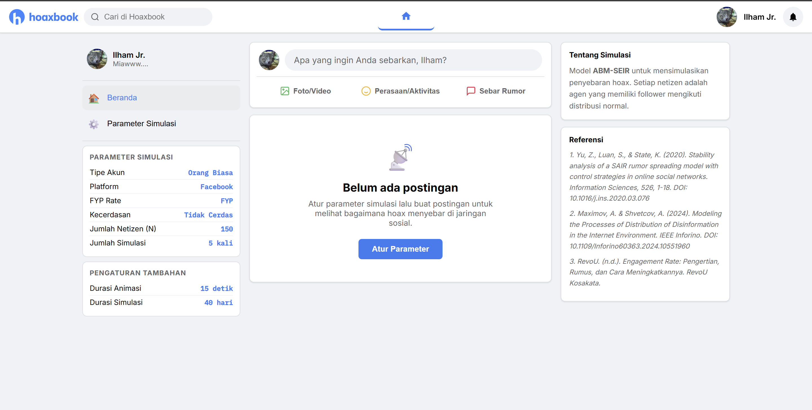
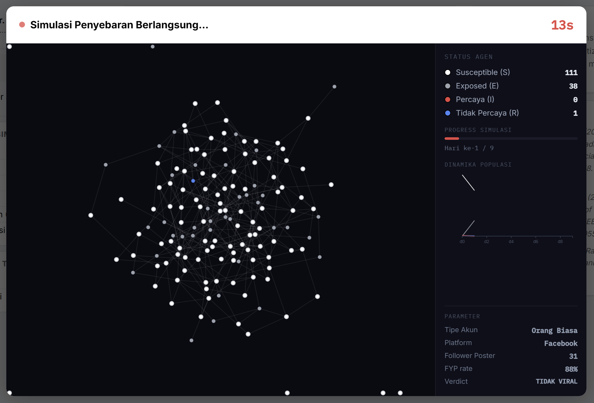
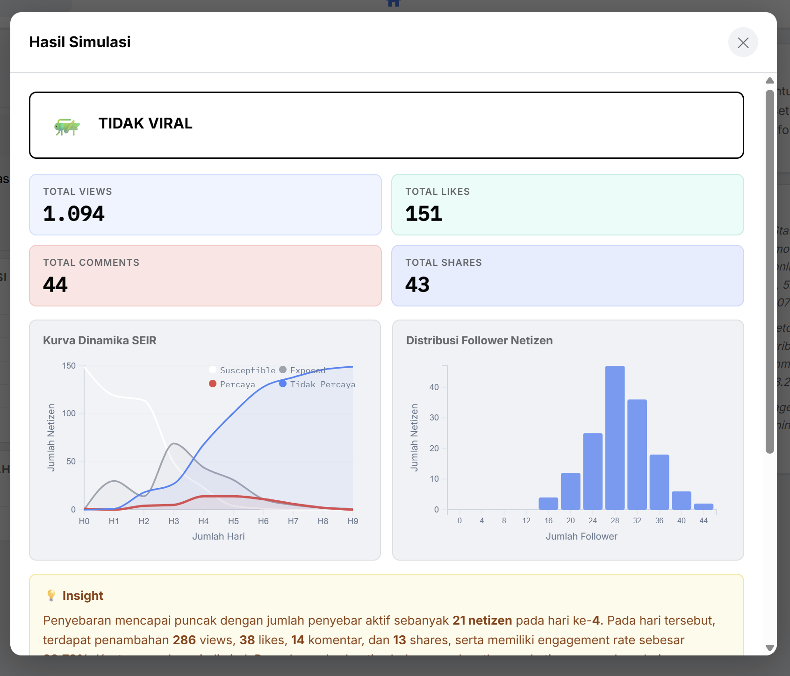

# HoaxBook

HoaxBook is a static web application for simulating the spread of hoaxes in a social network using an ABM-SEIR approach. The app presents posting flow, propagation to other users, network visualization, and simulation summaries in a social-media-style interface.

## Preview







## Main Features

- Agent-based hoax spread simulation.
- User state model with `S`, `E`, `I`, and `R`.
- Interactive network visualization using D3.js.
- Simulation parameter input through a settings modal.
- Hoax post creation with text and image upload.
- Monte Carlo simulation to produce averaged results across multiple runs.
- Results panel with timeline, engagement metrics, and state summaries.

## Technologies

- HTML
- CSS
- JavaScript
- D3.js

## Usage Flow

1. Open the **Simulation Parameters** menu.
2. Adjust the account type, platform, FYP category, user intelligence category, network size, animation duration, simulation duration, and number of runs.
3. Create a hoax post through the composer.
4. Run the simulation and observe how the content spreads through the network.
5. Review the final output in the simulation results panel.

## Simulation Parameters

The application lets you change the following values:

- Post author account type
- Social media platform
- FYP rate
- User intelligence category
- Number of users (`N`)
- Sigma for the `E -> I` transition
- Gamma for the `I -> R` transition
- Animation duration
- Simulation duration in days
- Monte Carlo run count

## Project Structure

```text
HoaxBook/
├── index.html        # Main application page
├── app.js            # UI controller and simulation flow
├── simulation.js     # ABM-SEIR simulation engine and Monte Carlo logic
├── style.css         # Application styling and layout
├── README.md         # Project documentation
├── doksli/           # Media and documentation assets
└── hoax/             # Logo and icon assets
```

## Model References

The simulation model and output presentation are inspired by the following references, which are also listed in the application:

1. Yu, Z., Luan, S., & State, K. (2020). *Stability analysis of a SAIR rumor spreading model with control strategies in online social networks.* Information Sciences, 526, 1-18.
2. Maximov, A. & Shvetcov, A. (2024). *Modeling the Processes of Distribution of Disinformation in the Internet Environment.* IEEE Inforino.
3. RevoU. *Engagement Rate: Definition, Formula, and How to Improve It.*

## Notes

Project website: [hoaxbook.ilkham.my.id](https://hoaxbook.ilkham.my.id)  
Article: [HoaxBook - SImulasi Stokastik Dinamika Penyebaran Hoaks di Media Sosial](https://app.notion.com/p/HoaxBook-SImulasi-Stokastik-Dinamika-Penyebaran-Hoaks-di-Media-Sosial-3710192d89138041beb1c1e675113344).  
  
*Some parts of this project and its documentation were created with the help of AI.
